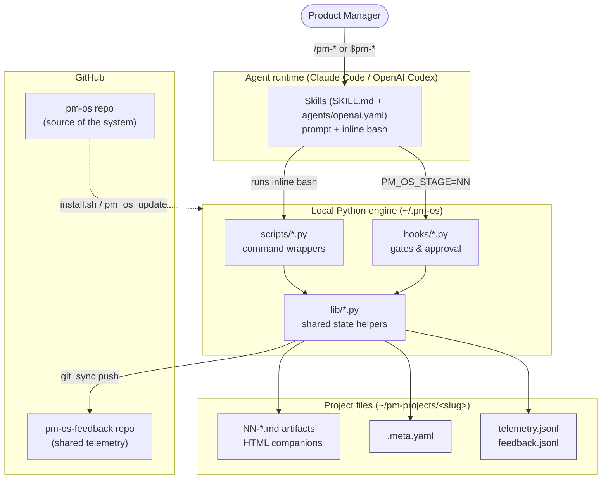
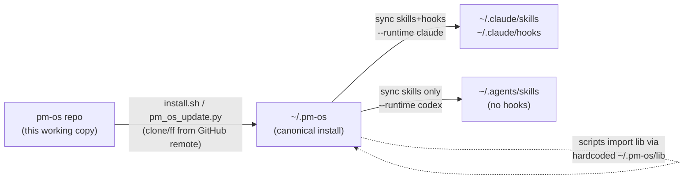
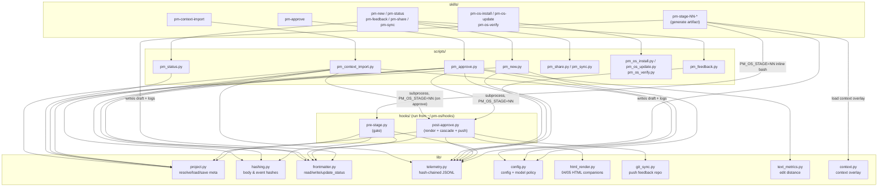
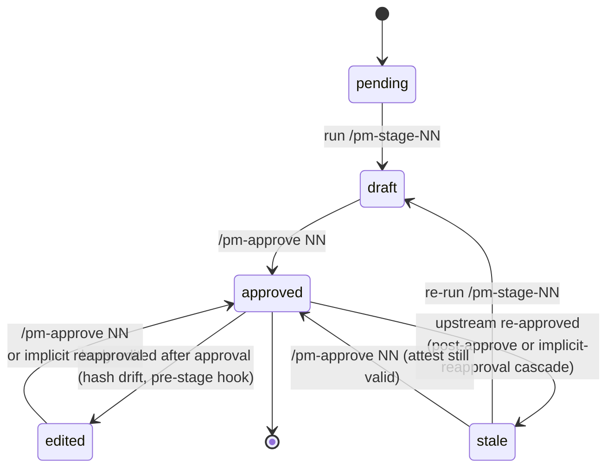
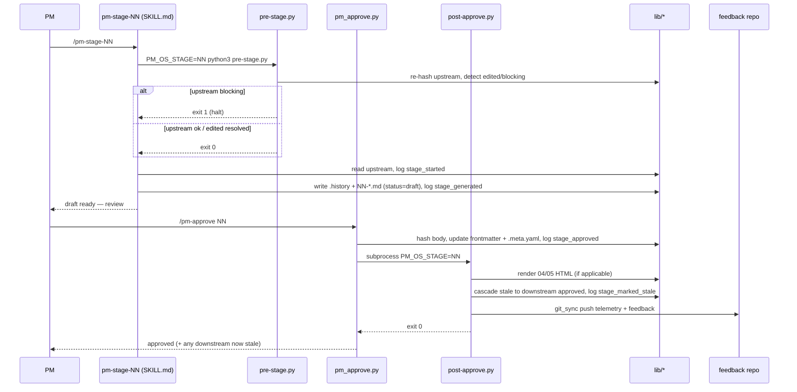

# PM-OS Architecture

This document describes the **as-built** architecture of PM-OS on the `main` branch. Where the build spec (`docs/spec/pm-os-spec.md`) and the running code differ, this document follows the code — see [Spec vs. implemented](#spec-vs-implemented) at the end.

PM-OS is a **local-first, PM-led product-definition layer** delivered as an **agent skill suite** — not an app. There is no frontend and no backend service. A PM drives a product idea through a fixed, gated pipeline of stages; each stage emits a Markdown artifact that a human reviews and explicitly approves before the next stage can run. All state is plain files on the PM's machine.

---

## 1. System context

PM-OS spans three planes: the **agent runtime** (the generation engine), the **local Python engine** (mechanical state), and **two GitHub repos** (source + shared telemetry).

**Key idea:** the agent is the *judgment/generation* layer (lives in `SKILL.md`); Python is the *mechanical state* layer (scaffold, hash, approve, gate, telemetry). Nothing progresses autonomously — a human approval sits at every stage boundary.

---

## 2. Install / sync topology

The repo you edit is **not** the running system. Code reaches the runtime in two hops.

- `install.sh --runtime claude|codex|all` clones `~/.pm-os` from the **GitHub remote** and syncs skills (and, for Claude, hooks) into the runtime discovery dirs.
- Gates always execute from `~/.pm-os/hooks` — the copy into `~/.claude/hooks` is vestigial/reserved for future native-hook registration. Codex skips hooks entirely.
- `scripts/*.py` insert `~/.pm-os/lib` on `sys.path`, so **edits in the working copy are inert until they reach `~/.pm-os`.**

---

## 3. Component wiring

How a stage actually runs, end to end, across skills → scripts → hooks → lib.

**State flows between scripts and hooks via the `PM_OS_STAGE` environment variable, not arguments.**

### Component responsibilities

| Component | Responsibility |
|-----------|----------------|
| `skills/pm-stage-NN-*/SKILL.md` | The stage prompt + the inline bash the agent runs: pre-stage gate, read upstream, generate, write draft, log telemetry. Ships an `agents/openai.yaml` twin for Codex. |
| `skills/pm-approve` → `scripts/pm_approve.py` | Validates status, computes body `content_hash`, writes approval to frontmatter + `.meta.yaml`, logs `stage_approved`, then shells out to `post-approve.py`. |
| `skills/pm-new` → `scripts/pm_new.py` | Scaffolds `~/pm-projects/<slug>/`: business statement, `.meta.yaml` (9 stages `pending`), empty telemetry/feedback, `.history/`. Sets `genai_flag`. |
| `skills/pm-context-import` → `scripts/pm_context_import.py` | Mechanical state for the context-intake flow. `register` preserves a raw source in `.history/` + `.sources.yaml` (logs `context_ingested`); `preflight` prints backfill-feasibility verdicts (`resolve_backfill`) and exits non-zero on an infeasible gap; `commit` stamps an SKILL-written artifact slot to draft/approved with `origin` (`generated`/`imported`/`backfilled`), body hash, meta + frontmatter, telemetry, and (on approve) `post-approve.py`. Generates no content — judgment lives in the SKILL. |
| `skills/pm-status` → `scripts/pm_status.py` | Reads `.meta.yaml`; reports stage statuses, recent events, feedback count. |
| `skills/pm-feedback` → `scripts/pm_feedback.py` | Appends a rating/tags/free-text entry to `feedback.jsonl`; logs `feedback_submitted` into the hash chain; triggers a central sync. |
| `skills/pm-sync` → `scripts/pm_sync.py` | Manual catch-up sync of **all** projects' telemetry/feedback to the central repo (`git_sync.push_all`); `--verify` validates every project's hash chain. |
| `skills/pm-share` → `scripts/pm_share.py` | Exports approved artifacts to a shareable text bundle. |
| `skills/pm-os-verify` → `scripts/pm_os_verify.py` | Health-checks the *installed* `~/.pm-os` for a runtime: config, `lib` imports, gate hooks, installed skills, plus a deterministic gate self-test that runs the real `pre-stage.py` in a throwaway project (asserts it blocks an unapproved upstream and allows stage 01) and a telemetry self-test. |
| `hooks/pre-stage.py` | **The gate.** Blocks if any upstream is `pending`/`draft`/`stale`; re-hashes approved upstreams to detect post-approval `edited` drift; runs the implicit-reapproval prompt, cascading `stale` to downstream approved stages on implicit reapproval. |
| `hooks/post-approve.py` | Renders HTML companions for stages 04/05, cascades `stale` to downstream approved stages, pushes telemetry/feedback via `git_sync`. |
| `lib/project.py` | `resolve_project()` walks up from CWD to the nearest `.meta.yaml`; stage order/name tables; `upstream_stage_ids()`. |
| `lib/hashing.py` | `hash_artifact_body()` (SHA-256 over body only, LF-normalized) and `hash_event()` (chain link). |
| `lib/frontmatter.py` | YAML frontmatter read/write/`update_status`. |
| `lib/telemetry.py` | Append-only, hash-chained JSONL event log; `last_event()` reader and `verify_chain()` validator. |
| `lib/config.py` | Loads `~/.pm-os/config.yaml`; applies runtime-neutral model policy (`default_model_tier`, `deep_reasoning_stages`); migrates from env vars. |
| `lib/html_render.py` | Jinja2 render of `04-design-spec.html` and `05-prototype-mockup.html`. |
| `lib/git_sync.py` | Clone-or-fetch the feedback repo cache, copy JSONL, commit, push. `push_feedback_repo()` (one project) and `push_all()` (every project) share one helper, report failures loudly with a status dict, and skip deleted projects. |
| `lib/text_metrics.py` | Pure-stdlib Levenshtein `char_edit_distance` + `normalized_edit_distance` for generated-vs-approved drift. |
| `lib/context.py` | **Context overlay loader.** `resolve_context()` / `render_context()` merge the company/team/glossary/guardrails **global** layer + per-stage **format/example** packs + a per-project override (precedence project > stage > global), applying `augment`/`override`/`reference-only` modes and dropping empty/TODO content so an unfilled pack is a no-op. `seed_context()` copies missing files from `context.example/` → `~/.pm-os/context/`. The 9 stage skills call it in a "Load context overlay" step; install/update seed it. The live `~/.pm-os/context/` is gitignored user data. |

---

## 4. Stage pipeline & state machine

Stages are fixed (`lib/project.py`): **01 brief → 02 scope → 03 prd → 04 design-spec → 05 prototype-brief → 06 qa-plan → 07 metrics-plan**, followed by optional capstones: **08 trd** and **09 roadmap**. Stage 08 and 09 both depend on stages 01-07. Stage 09 also depends on stage 08 when an approved TRD is available, so roadmap generation and approval can incorporate technical delivery context without making TRD mandatory.

Each stage carries one status. Two off-path states — `edited` (body changed after approval, caught by hash drift) and `stale` (an upstream was re-approved) — sit beside the happy path.

**Two synchronized sources of truth:** stage state lives in **both** `.meta.yaml` (`stages[]`) **and** each artifact's frontmatter, kept in lockstep by `pm_approve.py` and the hooks. `content_hash` is computed over the **body only**, so frontmatter edits never trigger false drift.

---

## 5. End-to-end sequence: generate → approve

---

## 6. Data & telemetry

- **`.meta.yaml`** — project metadata + `stages[]` list (id, name, status, `approved_at`, `content_hash`, `upstream_hashes_at_approval`, `regeneration_count`, `optional`, `origin`). Carries `schema_version` (currently 2; `lib/project.py:migrate_meta` upgrades older projects in place). `origin` is `generated | imported | backfilled`. The stage-00 understanding group (`00` business-statement, plus `00w`/`00u` when `/pm-context-import` is used) gates stage 01.
- **`.sources.yaml`** — registry of externally-provided sources ingested via `/pm-context-import` (id, type, uri, captured_at, snapshot path); raw originals preserved under `.history/`.
- **Artifact frontmatter** — `status`, `approved_at/by`, `content_hash`, `generated_hash`, `pm_os_version`, `genai_flag`, `generation_notes`, `origin`, followed by the Markdown body.
- **`telemetry.jsonl`** — append-only, hash-chained (`prev_event_hash` → `event_hash`). Event types include `project_created`, `stage_started`, `stage_generated`, `stage_approved`, `stage_imported`, `stage_backfilled`, `context_ingested`, `stage_edited_post_approval`, `stage_edited_via_note`, `implicit_reapproval`, `stage_marked_stale`, `feedback_submitted`. Telemetry failures warn but never break the workflow.
- **`feedback.jsonl`** — append-only stage feedback entries (`rating`, `note`, PM, project, timestamp). Feedback is also joined into `telemetry.jsonl` as `feedback_submitted` so it participates in the hash chain.
- Both JSONL files are pushed to the shared `pm-os-feedback` repo under `telemetry/<pm>/<slug>/`.

### What telemetry lets PM-OS infer

Telemetry is useful because it records both **workflow facts** (events that happened) and enough timestamps/hashes to derive **process signals**. The event log should be treated as evidence about PM-OS usage and artifact lifecycle, not as a complete record of all human reasoning outside the tool.

| What can be understood | How it is inferred | Supporting events / fields | Caveats |
|---|---|---|---|
| Project creation volume | Count `project_created` events by PM, project, version, and time window. | `event_type`, `pm`, `project`, `pm_os_version`, `timestamp` | Projects created before telemetry or never synced centrally may be missing from shared analysis. |
| Stage funnel progress | For each project, read the latest stage events and `.meta.yaml` status to see which stages started, generated, approved, edited, stale, imported, or backfilled. | `stage_started`, `stage_generated`, `stage_approved`, `stage_imported`, `stage_backfilled`, `stage_marked_stale`, `.meta.yaml` | Telemetry is chronological evidence; `.meta.yaml` is the current state snapshot. Use both when diagnosing. |
| Time spent generating a stage | Difference between `stage_started.timestamp` and the matching `stage_generated.timestamp`. | `stage_started`, `stage_generated`, `stage` | This measures elapsed agent/workflow time, not pure model runtime. It can include tool execution and user interruption. |
| Time from draft to approval | `stage_approved.payload.time_to_approve_seconds`, computed from `stage_generated` to approval when a generated snapshot exists. | `stage_generated`, `stage_approved.payload.time_to_approve_seconds` | Correctly `null` for stage-00 docs, imported artifacts, and backfilled artifacts that did not have a generated snapshot. |
| PM edit effort before approval | Compare generated snapshot body with approved artifact body. Current approval telemetry records character and normalized edit distance. | `.history/*.generated.md`, approved artifact body, `stage_approved.payload.char_edit_distance`, `normalized_edit_distance` | Character distance measures textual change, not meaning. Formatting-only edits can look larger than their product impact. |
| Semantic drift from generated draft | Agent-estimated drift can be passed on approval when available. | `stage_approved.payload.semantic_distance` | Subjective and runtime-dependent. Treat as review guidance, not a deterministic metric. |
| Model usage by stage | `stage_generated.payload.model` captures the actual model id supplied by the agent; `model_tier` captures PM-OS policy tier for the stage. | `stage_generated.payload.model`, `stage_generated.payload.model_tier`, `config.deep_reasoning_stages` | The model id is only as reliable as the agent/runtime filling it in. Older events may lack it. |
| Regeneration frequency | Use stage metadata and approval payloads to count how many times a stage was regenerated before approval. | `.meta.yaml.stages[].regeneration_count`, `stage_approved.payload.regeneration_count`, repeated `stage_generated` | Regeneration count is per stage, not a full explanation of why regeneration happened. Use `generation_notes` and feedback for context. |
| Steering note impact | Notes used during generation appear in frontmatter and `stage_generated` payload; upstream edits made because of notes log `stage_edited_via_note`. | Artifact `generation_notes`, `stage_generated.payload.notes`, `stage_edited_via_note.payload.note`, `edited_sections` | Notes explain explicit steering, not every implicit PM preference. |
| Imported versus generated pipeline shape | `origin` and import/backfill events show whether a stage was authored by PM-OS, imported from PM material, or backfilled from supplied downstream context. | `.meta.yaml.stages[].origin`, artifact frontmatter `origin`, `stage_imported`, `stage_backfilled`, `context_ingested` | Imported/backfilled artifacts may skip generation metrics by design. Use provenance rather than treating them as normal generated drafts. |
| Context intake coverage | Registered sources and backfill verdicts indicate what material was provided, preserved, adopted, or only used as context. | `.sources.yaml`, `context_ingested`, `stage_imported`, `stage_backfilled`, `payload.source_*`, `payload.derived_from` | The event log proves provenance and movement through PM-OS, not that the source content was complete or correct. |
| Upstream drift and rework | Detect approved artifacts edited after approval, implicit reapprovals, and downstream stale cascades. | `stage_edited_post_approval`, `implicit_reapproval`, `stage_marked_stale`, `payload.triggering_upstream_stage(s)` | Drift is detected lazily by the pre-stage gate on later runs, not continuously at every file edit. |
| Feedback quality signals | Stage ratings and notes can be joined to generation, approval, model, edit distance, and stage metadata. | `feedback.jsonl`, `feedback_submitted.payload.rating`, `free_text`, `stage` | Feedback is optional; null ratings or sparse notes are absence of signal, not proof of quality. |
| Sync and data freshness | Central repo contents plus local `pm-sync --verify` reveal whether projects have intact chains and whether telemetry reached the shared cache. | `telemetry.jsonl`, `event_hash`, `prev_event_hash`, `pm_sync.py --verify`, `git_sync` status | A valid local chain does not guarantee central sync succeeded. Sync failures are operational issues, not workflow events unless separately captured. |
| Tamper or corruption detection | Recompute each event hash from the previous event hash and payload. The first mismatch identifies where the chain broke. | `event_hash`, `prev_event_hash`, `telemetry.verify_chain()` | Hash chaining detects edits to telemetry lines, not edits to artifacts unless artifact hashes or stage status are also checked. |

Useful aggregate views from these signals:

- **Adoption:** projects created, stages started/generated/approved, optional 08/09 usage, context-import usage.
- **Throughput:** elapsed time per stage, approval cycle time, stages completed per project.
- **Quality and rework:** edit distance, semantic distance when present, regeneration count, stale cascades, feedback ratings/notes.
- **Process risk:** unapproved blockers, edited upstreams, stale downstream artifacts, broken telemetry chains, failed central sync.
- **Runtime/model policy:** model ids actually used, model tier by stage, deep-reasoning stage compliance.

For diagnosis, prefer a layered read:

1. Verify the telemetry chain with `pm-sync --verify` or `telemetry.verify_chain()`.
2. Read `.meta.yaml` for current stage state.
3. Read `telemetry.jsonl` for the chronological event trail.
4. Read artifact frontmatter and `.history/` snapshots to explain hashes, generated drafts, approvals, and edit distance.
5. Read `feedback.jsonl` and `feedback_submitted` events for PM judgment about quality or usefulness.

---

## 7. Runtime agnosticism

Every skill ships **`SKILL.md`** (Claude, YAML frontmatter) **and** **`agents/openai.yaml`** (Codex interface metadata). `install.sh` / `pm_os_update.py` route to `~/.claude/{skills,hooks}` for Claude and `~/.agents/skills` for Codex (Codex skips hooks). Model choice is **config-driven, not hardcoded**: `config.py` stores `default_model_tier` and `deep_reasoning_stages` (`["03","06","08"]`); skills advise running deep-reasoning stages on the strongest available model rather than naming a provider model id.

---

## Spec vs. implemented

`docs/spec/pm-os-spec.md` is partly aspirational. The `main` code is **leaner** than the spec in these ways — trust the code:

| Spec describes | Status on `main` |
|----------------|-----------------|
| `lib/edit_distance.py`, `lib/embeddings.py` | **Replaced/deferred.** Character and normalized edit distance are implemented in `lib/text_metrics.py`; embedding-based semantic distance is not built and is only recorded when the approving agent supplies an estimate. |
| `hooks/post-tool-use.py` | **Not built.** Out-of-band edits are detected lazily by `pre-stage.py` on the next stage run, not on every tool use. |
| `hooks/session-end.py` | **Not built.** Telemetry writes are synchronous; `telemetry.flush_pending()` is a no-op. |
| Full MCP `pm-share` integration | `pm_share.py` exports a text bundle; no live connector. |
| `sentence-transformers` dependency | Not installed. Runtime deps are `pyyaml`, `jinja2`, `gitpython` only. |

Everything else in this document reflects code that exists and runs on `main`.
